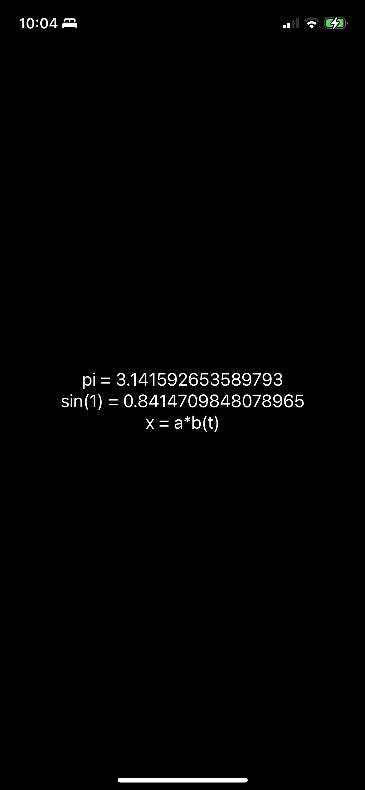

# BeeSwift
Add Python to a SwiftUI application with the BeeWare Briefcase.

This project is derived from the [tutorial provided by the BeeWare Project](https://docs.beeware.org/en/latest/), reduced to those steps that are applicable to iOS development, then extended to add support for Swift.
With BeeWare, a template XCode project is generated using `briefcase`, which also provides a convenient way to manage requirements (Python libraries that are imported in your scripts).

The typical approach is to use [Toga](https://beeware.org/project/projects/libraries/toga/) for UI development.
Many iOS developers are more familiar with `UIKit` and `SwiftUI`, or may require specialized iOS features.
Here, the Swift interoperability is achieved by creating an `AppDelegate` class in Objective C and creating an extension for that class in Swift, with supporting headers to form a bridge.
An optional step is to include [PythonKit](https://github.com/pvieito/PythonKit) which provides a convenient syntax for calling Python objects in Swift, however, the [Python C API](https://docs.python.org/3/c-api/index.html) may also be used.


## Setup Virtual Environment

A virtual environment is created below, which serves to isolate the Python environment used in creating the BeeWare project from your system default Python installation. 
This is not required, but is recommended in the [tutorial](https://docs.beeware.org/en/latest/).
For the demonstration, `sympy` is used as an example "Pure-Python" library that will be tested in the app.

```
python3 -m venv venv
source venv/bin/activate
pip install sympy
python -m pip install briefcase
```

## Start a New Project

The command below will begin populating a directory with a name derived from the app name (in this example, `beeswift`) and various default scripts.

```
briefcase new
```

There will be several user prompts at this point, where you can choose either the defaults in brackets, or app-specific responses.
In this case, the app name `Bee Swift` and the description are provided, other defaults are accepted by typing enter at the prompt.

```
Formal Name [Hello World]: Bee Swift
App Name [beeswift]:
Bundle Identifier [com.example]:
Project Name [Bee Swift]: 
Description [My first application]: Add Python to a SwiftUI application with the BeeWare Briefcase
Author [Jane Developer]:
Author's Email [jane@example.com]:
Application URL [[https://example.com/beeswift]:
Project License [1]:
GUI Framework [1]:
```

## Set Python Requirements

Next we `cd` into the `beeswift` folder (or alternate app name), where we will modify the app requirements code.
In this example, we are using `sympy`, though for your application you will likely have other required Python modules to make your app work.

```
cd beeswift
vim pyproject.toml
```

Type `a` to append text, then scroll to the line that containes the requirements for the iOS app.
Specifically make sure this is under the `# Mobile deployments` line, and is preceeded by `[tool.briefcase.app.beeswift.iOS]`.
Add `sympy` and the version number to the `requires = ... ` section.

```
# Mobile deployments
[tool.briefcase.app.beeswift.iOS]
requires = [
    'toga-iOS>=0.3.0.dev34',
    'std-nslog~=1.0.0',
    'sympy==1.11.1'
]
```

Press the `esc` button and then type `:wq` and `enter` to write and quit.


## Create the iOS Project

The command below will generate the `./iOS/XCode/Bee Swift/` directory, with `Bee Swift.xcodeproj` and various other support files.
From this point, you may navigate to this project file in Finder, and open it, as the subsequent steps will completed with XCode.

```
briefcase create iOS
```

## (Optional) Add PythonKit to the iOS Project

In XCode, go to `File -> Add Package`s, click GitHub on the left hand side, click the plus button on the lower left.
In the search field in the upper right, enter the following

```
https://github.com/pvieito/PythonKit.git
```

Click `Add Package` in the lower right corner.
If you do choose to skip this optional step, then portions of the code in the `AppDelegateExtension` created in a later step will not work.


## Create Objective C AppDelegate Header

In XCode, in the tree on the left hand side, right click `Supporting Files` and then `New File`.
Select `Header File` in the menu, then click `Next`.
Enter the name `AppDelegate` then click `Create`, without modifying any defaults.
Under the commented header section, delete any uncommented code, and replace with the following.

```objc
#import <UIKit/UIKit.h>

@interface AppDelegate : UIResponder <UIApplicationDelegate>

@property (strong, nonatomic) UIWindow *window;


@end
```

## Create Objective C AppDelegate Class

In Xcode, in the tree on the left hand side, right click `Supporting Files` and then `New File`.
Select `Objective C File` in the menu, then click `Next`.
Enter the name `AppDelegate` then click `Next`, and finally `Create` on the next window, without modifying any defaults.

```objc
#import "AppDelegate.h"
#include <Python.h>
#import "Bee_Swift-Swift.h"

@interface AppDelegate ()

@end

@implementation AppDelegate

- (BOOL)application:(UIApplication *)application didFinishLaunchingWithOptions:(NSDictionary *)launchOptions {
    [self swiftuiExtension];
    return YES;
}

@end
```

## Create Swift AppDelegate Extension

In Xcode, in the tree on the left hand side, right click `beeswift` and then `New File`.
Select `Swift File` in the menu, then click `Next`.
Enter the name `AppDelegateExtension` then click `Create`, without modifying any defaults.
On the subsequent popup, click the option to `Create Bridging Header`.
Inside the newly created `Bee Swift-Bridging-Header.h` file add the following.

```
#include <Python.h>
#include <dlfcn.h>
#include "AppDelegate.h"
```

Inside the new `AppDelegateExtension.swift` file, add the following.

```swift
import Foundation
import SwiftUI
import UIKit
import PythonKit

@objc public extension AppDelegate {
    @objc func swiftuiExtension() {
        // Do some Python stuff
        let math = Python.import("math")
        let pi = math.pi
        let piStr = "pi = \(pi)"
        let answer = "sin(1) = \(math.sin(1))"

        // Do some sympy stuff
        let sympy = Python.import("sympy")
        let a = sympy.symbols("a")
        let mechanics = Python.import("sympy.physics.mechanics")
        let b = mechanics.dynamicsymbols("b")
        let ab = a*b
        let abStr = "x = \(ab)"
        
        // Build a SwiftUI
        self.window = UIWindow(frame: UIScreen.main.bounds)
        window.makeKeyAndVisible()
        window.rootViewController = UIHostingController(
            rootView: VStack {
                Text(piStr)
                Text(answer)
                Text(abStr)
            }
        )
    }
}
```

## Update the Objective C Main File

Modify the call to `UIApplicationMain` in the `main.m` script, replacing `@PythonAppDelegate` with `@AppDelegate`.

```objc
UIApplicationMain(argc, argv, nil, @"AppDelegate");
```

## Run the app

If all the previous steps ran as-intended, then you should be able to run and see a simple app window, showing the value for `pi`, sine of 1, and a basic symbolic expression.


